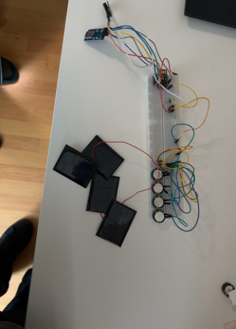

# Solar-Powered Temperature & Humidity Data Logger

## Project Overview
This project predicts future temperature and humidity at remote, off-grid sites using a solar-powered logger and machine learning (AutoGluon). It combines sensor data with real weather forecasts for accurate, actionable predictions.

## Hardware Setup



Data is collected using a custom-built, solar-powered environmental logger. The core of the logger is a Raspberry Pi Pico microcontroller running `pico.js` (JavaScript for microcontrollers).
- **Sensor:** DHT20 digital sensor for temperature and humidity measurements.
- **Power:** The system is powered by multiple small solar panels and supercapacitators that stores the energy.
- **Data Logging:** Sensor readings are recorded at regular intervals (e.g., every 10 seconds) and stored locally in CSV format (`ubi_data.csv`). Data is periodically retrieved for analysis and machine learning.

## Data Collection
- The logger records temperature and humidity at regular intervals, storing the data in a CSV format (`ubi_data.csv`).
- **Workflow:**
  1. The logger is deployed at a remote site and powered by solar energy.
  2. Sensor readings are logged and periodically downloaded for analysis.
  3. The raw data is processed and used for machine learning predictions.

## Presentation Summary
This project and its workflow were presented in detail, including:
- The design and deployment of the solar-powered logger
- Data collection and preprocessing steps
- Integration of external weather data (Open-Meteo)
- Use of AutoGluon for automated time series forecasting
- Development of an interactive Streamlit app for user-friendly predictions
- Discussion of results, challenges, and future improvements

## Folder Structure
- `utils/` — All scripts (preprocessing, training, app, etc.)
- `data/` — All data files (raw, processed, merged)
- `images/` — Project and hardware images
- `AutogluonModels/` — Trained models

## How to Run
1. Place your raw data in `data/ubi_data.csv` (collected from the logger running pico.js).
2. Run the full pipeline:
   ```
   python utils/main.py
   ```
3. Launch the prediction app:
   ```
   streamlit run utils/app.py
   ```
4. Use the app in your browser to get predictions for any date/time!

## Requirements
- Python 3.12
- All dependencies are listed in both `requirements.txt` (for pip) and `environment.yml` (for conda).

### To install with pip:
```bash
pip install -r requirements.txt
```

### To create the environment with conda:
```bash
conda env create -f environment.yml
```

## Example Workflow
1. **Preprocess sensor data:**
   - Extracts clean readings from raw CSV.
2. **Fetch weather data:**
   - Downloads historical weather for Siegen, Germany.
3. **Merge data:**
   - Combines sensor and weather data for ML.
4. **Train model:**
   - Trains AutoGluon time series model.
5. **Predict:**
   - Use the Streamlit app to get future predictions, using real weather forecasts for future dates.

## Acknowledgements
- Data collection powered by `pico.js` and custom solar logger hardware
- Weather data from [Open-Meteo](https://open-meteo.com/)
- ML powered by [AutoGluon](https://auto.gluon.ai/)
